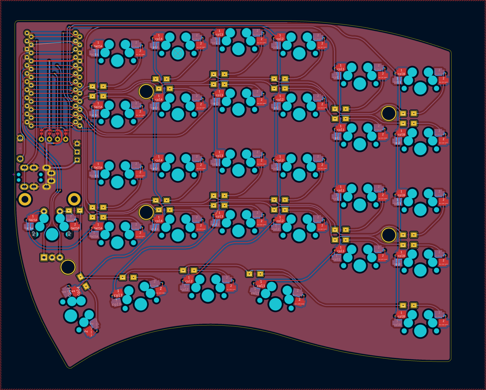

# Soufflé Keyboard

Soufflé v2 is 6×4+1+4+1 keys column-staggered split keyboard with encoder support, based on the [Sofle](https://github.com/josefadamcik/SofleKeyboard) and re-inspired by the [Lily58](https://github.com/kata0510/Lily58) keyboards. It also takes a bit of layout ideas from the Kyria.

Soufflé was created by [Jesus Climent](https://https://github.com/climent/).

Key features:

*   Palm key at the bottom of the outer pinky column.
*   Choice between rotary encoder or key switch for the inner keys.
*   Removed i2c communication betweek halves.
*   Redone layout with simplified, curved tracks.
*   Originally based on the Soufflé V1 release layout,
    *   the two pinky columns have been lowered ~.5cm.
    *   the thumb cluster repositioned to allow for equal reach of the keys.

## Firmware 

Soufflé uses [QMK firmware](https://qmk.fm/) and it is fully compatible with the Sofle firmware.

## Default layout 

Soufflé uses a similar layout than the Sofle, with a full 6x5 matrix, and the encoders connected to the same pins. The main difference is the position of the outermost thumb key, which has been moved to the bottom of the pinky column, to be used with the palm.

## Images of keyboard

## Older versions

In this repository you will find 3 releases of the Soufflé Keyboard:

*   V1: Based on the Sofle v1 and the Lily58. Key features:
    *   Added the palm key at the bottom of the pinky column.
    *   Some re-routing done and some label fixes, but modtly unchanged from the Sofle v1.
*   VR: Based on the Sofle RGB. Key features:
    *   Same palm key configuration then the V1.
    *   The layout footprint is based on the RGB, and thus the thumb cluster is slightly displaced to the center (compared to the V1).
    *   The encoder footprint shares a switch footprint, allowing for the user to choose what to put there.
    *   Pins for the encoder/switch have been exposed, as the top case plate can accommodate a roller encoder.
